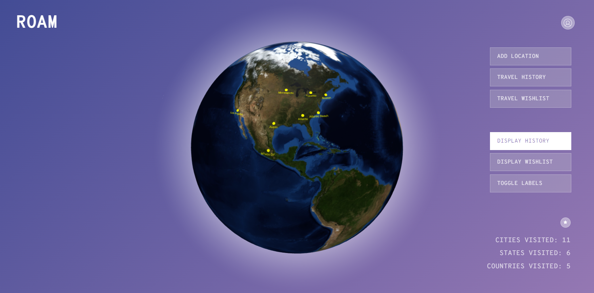
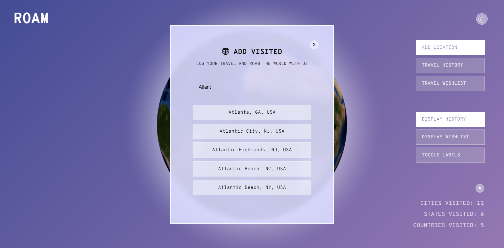
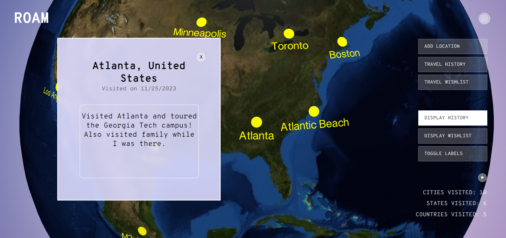
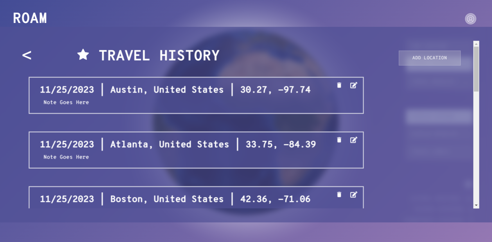
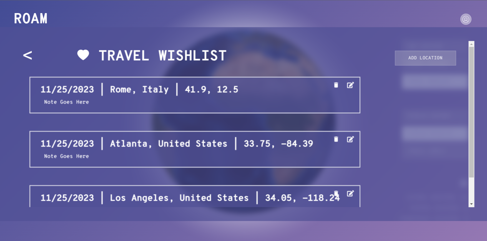
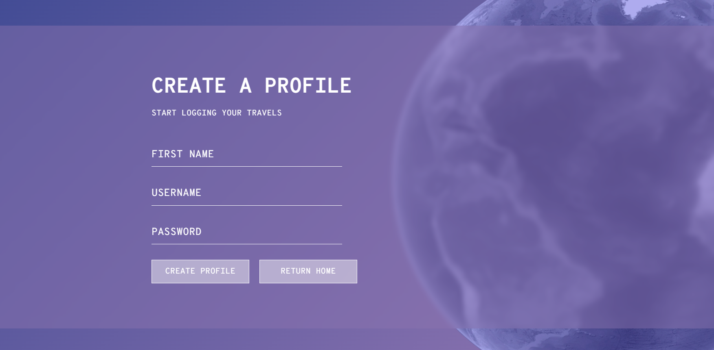
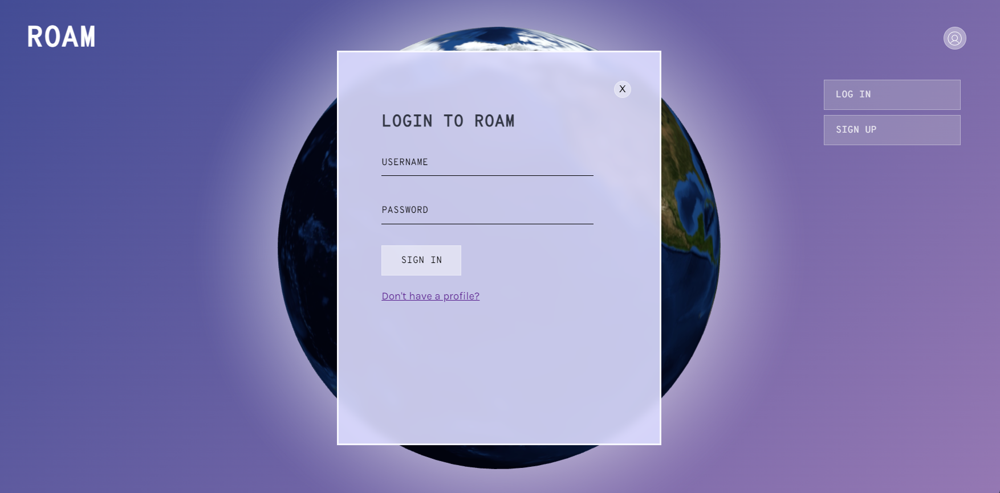

# Roam: A Travel App
## Project Description
Log your travel experiences on an interactive globe that you can rotate, zoom, and click on to see the places you have traveled to. After completing a trip, mark your memories on the globe by clicking "Add Location" and then searching for the city you visited. Add notes to remember your journey! You can also plan your future adventures using our wishlist feature. Add notes of landmarks you plan to visit or sights you plan to see when you go on the trip of your dreams.

<p float="left">

</p>

## Features

### The 3D Globe: Your Digital Travel Log

Roam uses the Google Maps Geocoding API to generate location predictions based on user input. By selecting a location, you can automatically pin a place you have visited onto a rotating, interactive globe that lets you better visualize your journeys.

Clicking on a pin will provide you with more information including the location of choice, the date you visited, and any notes you took about your travels.

<p float="left">
 
 
</p>

### Cities Visited and the Travel Wishlist

You can view your travel history as a list with additional functionality. In list view, you can see the latitude and longitude of the location, edit your existing notes or take new notes, and delete places from your log book. 

You can also toggle views between the cities you've visited and a wishlist of cities you want to visit in the future, allowing you to plan your future travels within Roam.

<p float="left">
  
   
</p>

### Integrating Cloud and Local Storage

When you first join Roam, you will need to create a free account. This allows us to store your user information including your cities visited, wishlist, notes taken, and more in our MongoDB database so you can access your data from any device. Your data will also be saved to local storage allowing for data to persist between sessions.

<p float="left">
  
   
</p>


## Technologies Used

### Frontend
- React
- Javascript
- HTML
- CSS

### Backend
- Python
- Flask
- MongoDB
- Google Maps Geocoding API
- Vercel

## How to Use

### Install dependencies

```bash
npm install
```

### Run the development server

```bash
npm start
```