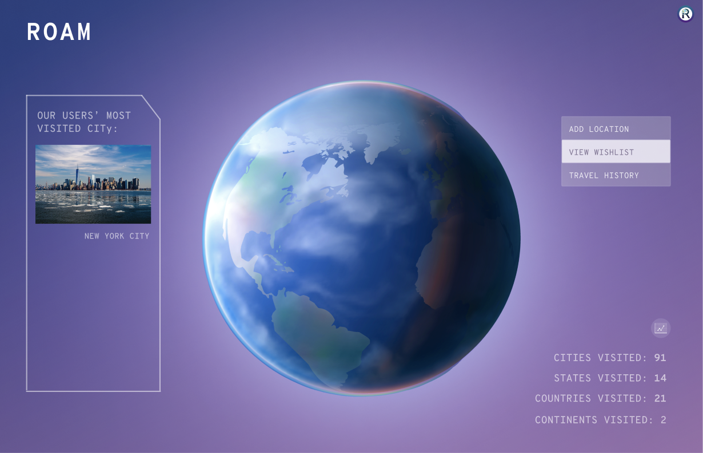
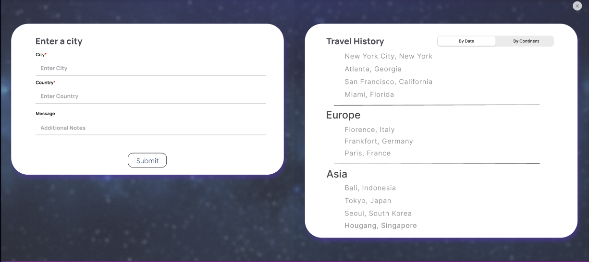

# Roam: A Travel App
### Project Description
What if there was a way to keep track of where you've traveled to? Or have a list catered to where you'd like to go next? \
Roam is the way to go to have all your travel dreams in one app!

### Features
The landing page consists of a globe that the user is able to add pins to. The pins are categorized into two lists - Wishlist and Travel History. When either category is selected, pins of the relevant list will appear on the globe.

Here is a preview of how a user would add a new location to their pins.

A feature that will be added in the future is a Travel History Screen, where the user will be given the option to add their own notes and upload pictures of a location.

Another feature that will be added in the future is a Wishlist Screen, where the user will be shown their wishlist. There will also be an option for users to create notes on a location, like adding landmarks/restaurants to be visited.
