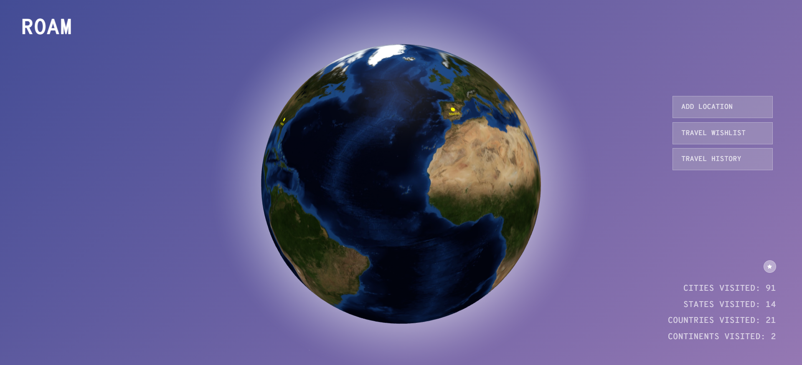
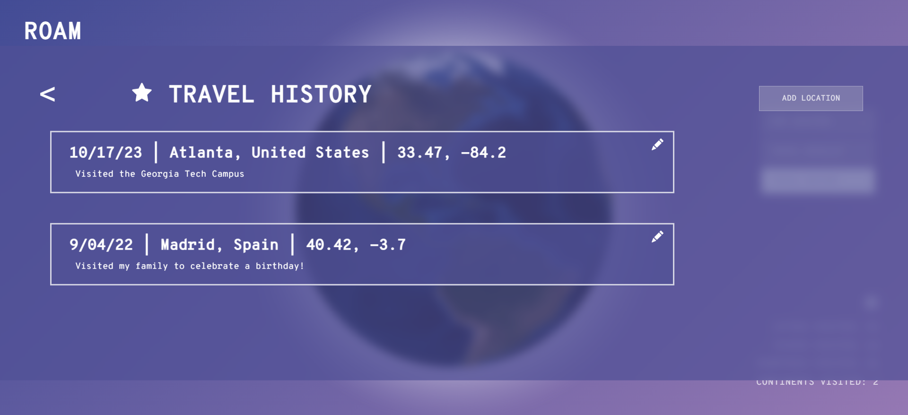
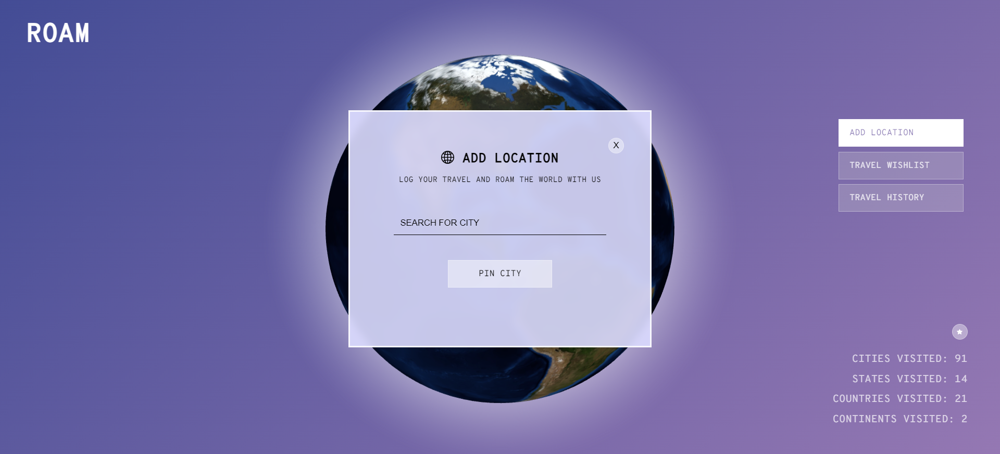
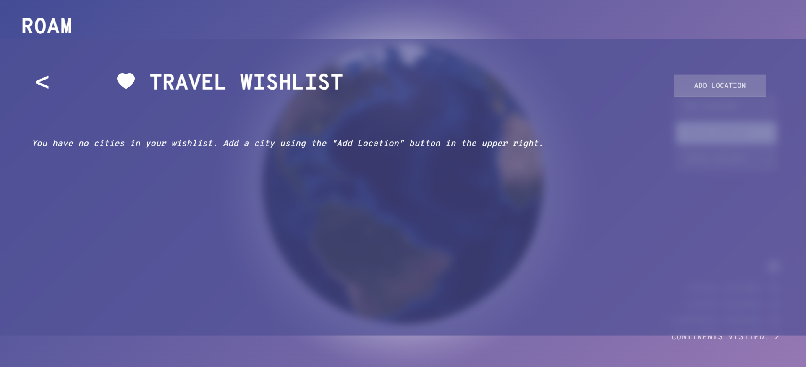

# Roam: A Travel App
### Project Description
Log your travel experiences on an interactive globe that you can rotate, zoom, and click on to see the places you have traveled to.
After completing a trip, mark your memories on the globe by clicking "Add Location" and then searching for the city you visited. Add notes to remember your journey! You can also plan your future adventures using our wishlist feature. Add notes of landmarks you plan to visit or sights you plan to see when you go on the trip of your dreams.

### Features
The landing page consists of a globe that the user is able to add pins to. The pins are categorized into two lists - Wishlist and Travel History. When either category is selected, pins of the relevant list will appear on the globe.

Here is a preview of our landing page with our interactive globe and location pins.

Users can add a location by searching for a city they visited. We use Google Maps API to plot the city on the globe at the correct latitude and longitude.

Users can also view their travel history as a list. On this page, you can see and edit the places you visited along with the notes you made.

Users can also plan the places they wish to visit using our wishlist feature to plan their future adventures and keep notes of important travel planning details such as the landmarks they want to visit.